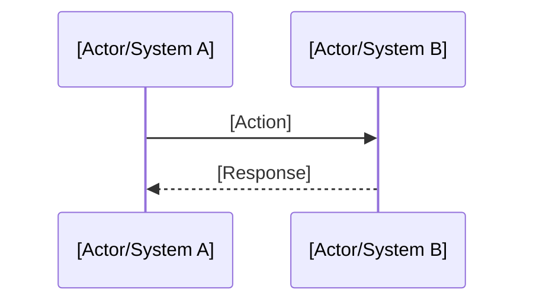

<!--
================================================================================
GUIA: Fluxo Cross-Context (Flow)
================================================================================

QUANDO USAR
Use este tipo para documentar fluxos que atravessam multiplos contextos.
Crie um flow quando:
- O processo envolve 2+ modulos/contexts
- Ha orquestracao entre sistemas
- O fluxo tem estados e transicoes definidos
- Existem pontos de falha que precisam de tratamento

CAMPOS OBRIGATORIOS
- title: Nome descritivo (ex: "User Onboarding Flow")
- status: draft | active | deprecated

CAMPOS OPCIONAIS
- owner: Responsavel pelo fluxo

RELACIONAMENTOS
- Atravessa: multiplos contexts
- Referencia: specs das funcionalidades envolvidas
- Documenta: decisoes (ADRs) sobre o fluxo

DICAS
- Use Mermaid para diagramas de sequencia
- Documente o happy path E cenarios alternativos
- Inclua pontos de falha e acoes de recuperacao
- Liste regras de negocio que governam o fluxo

Apague este bloco de comentario ao usar o template.
================================================================================
-->

# {{FLOW_NAME}}

> {{FLOW_DESCRIPTION}}

## Overview

[Description of the flow's purpose in 2-3 paragraphs]

## Modules Involved

| Module | Responsibility in Flow |
|--------|------------------------|
| [Module A] | [What it does in this flow] |
| [Module B] | [What it does in this flow] |

## Main Flow (Happy Path)

### Steps

1. **[Step 1]**: [Description]
   - Input: [required data]
   - Output: [expected result]
   - Owner: [module]

2. **[Step 2]**: [Description]
   ...

## Alternative Scenarios

### [Alternative Scenario Name]

[When it occurs and how the flow behaves]

## Error Handling

| Failure Point | Cause | Recovery Action |
|---------------|-------|-----------------|
| [Step X] | [Reason] | [Retry/Rollback/Manual] |

## Business Rules

- [ ] [Rule 1]: [Description]
- [ ] [Rule 2]: [Description]

## Dependencies

- **APIs**: [List of consumed APIs]
- **Events**: [Emitted/consumed events]
- **Data**: [Manipulated entities]

## Related

- Contexts: [[contexts/{{CONTEXT}}]]
- Specs: [[specs/{{SPEC}}]]
- ADRs: [[decisions/ADR-XXX]]
