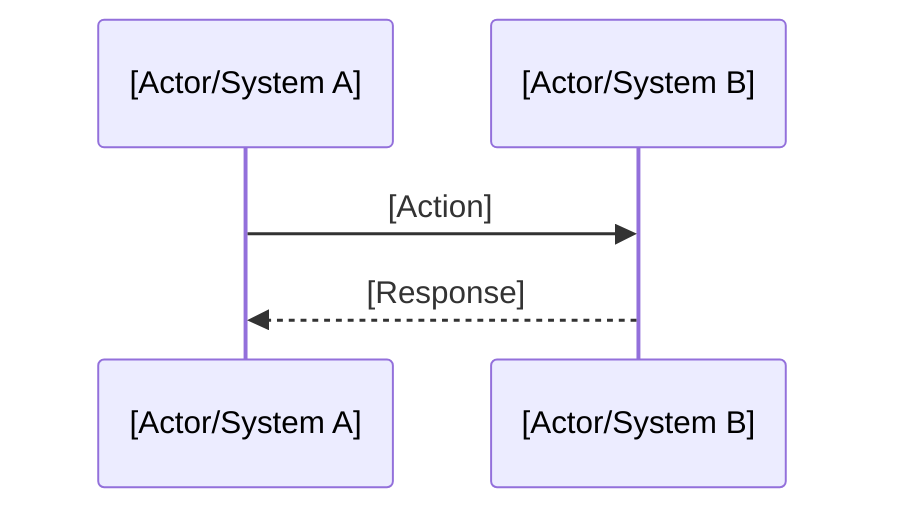

# {{FLOW_NAME}}

> {{FLOW_DESCRIPTION}}

## Metadata

| Field | Value |
|-------|-------|
| Status | draft / active / deprecated |
| Created | {{CREATED_DATE}} |
| Updated | {{UPDATED_DATE}} |
| Owner | {{OWNER}} |

## Overview

[Description of the flow's purpose in 2-3 paragraphs]

## Modules Involved

| Module | Responsibility in Flow |
|--------|------------------------|
| [Module A] | [What it does in this flow] |
| [Module B] | [What it does in this flow] |

## Main Flow (Happy Path)

### Steps

1. **[Step 1]**: [Description]
   - Input: [required data]
   - Output: [expected result]
   - Owner: [module]

2. **[Step 2]**: [Description]
   ...

## Alternative Scenarios

### [Alternative Scenario Name]

[When it occurs and how the flow behaves]

## Error Handling

| Failure Point | Cause | Recovery Action |
|---------------|-------|-----------------|
| [Step X] | [Reason] | [Retry/Rollback/Manual] |

## Business Rules

- [ ] [Rule 1]: [Description]
- [ ] [Rule 2]: [Description]

## Dependencies

- **APIs**: [List of consumed APIs]
- **Events**: [Emitted/consumed events]
- **Data**: [Manipulated entities]

## Related Links

- Context: [[contexts/context-name]]
- Spec: [[discovery/specs/spec-name]]
- ADR: [[decisions/ADR-XXX]]
