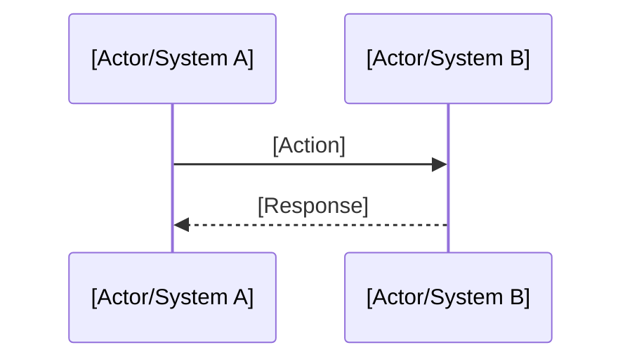

<!--
================================================================================
GUIDE: Cross-Context Flow (Flow)
================================================================================

WHEN TO USE
Use this type to document flows that span multiple contexts.
Create a flow when:
- The process involves 2+ modules/contexts
- There is orchestration between systems
- The flow has defined states and transitions
- There are failure points that need handling

REQUIRED FIELDS
- title: Descriptive name (e.g., "User Onboarding Flow")
- status: draft | active | deprecated

OPTIONAL FIELDS
- owner: Flow owner

RELATIONSHIPS
- Crosses: multiple contexts
- References: specs of involved features
- Documents: decisions (ADRs) about the flow

TIPS
- Use Mermaid for sequence diagrams
- Document the happy path AND alternative scenarios
- Include failure points and recovery actions
- List business rules that govern the flow

Delete this comment block when using the template.
================================================================================
-->

# {{FLOW_NAME}}

> {{FLOW_DESCRIPTION}}

## Overview

[Description of the flow's purpose in 2-3 paragraphs]

## Modules Involved

| Module | Responsibility in Flow |
|--------|------------------------|
| [Module A] | [What it does in this flow] |
| [Module B] | [What it does in this flow] |

## Main Flow (Happy Path)

### Steps

1. **[Step 1]**: [Description]
   - Input: [required data]
   - Output: [expected result]
   - Owner: [module]

2. **[Step 2]**: [Description]
   ...

## Alternative Scenarios

### [Alternative Scenario Name]

[When it occurs and how the flow behaves]

## Error Handling

| Failure Point | Cause | Recovery Action |
|---------------|-------|-----------------|
| [Step X] | [Reason] | [Retry/Rollback/Manual] |

## Business Rules

- [ ] [Rule 1]: [Description]
- [ ] [Rule 2]: [Description]

## Dependencies

- **APIs**: [List of consumed APIs]
- **Events**: [Emitted/consumed events]
- **Data**: [Manipulated entities]

## Related

- Contexts: [[contexts/{{CONTEXT}}]]
- Specs: [[specs/{{SPEC}}]]
- ADRs: [[decisions/ADR-XXX]]
